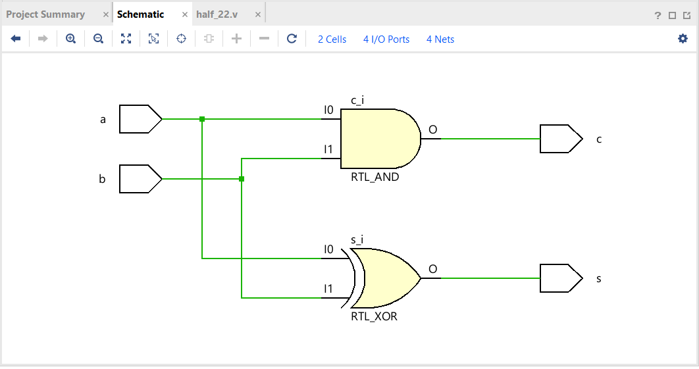
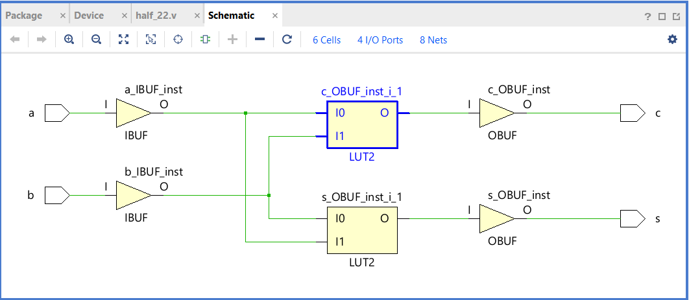

**Project: Half Adder (RTL Analysis & Synthesis)**

In this project, a Half Adder was designed in Verilog with input ports a, b and output ports s (sum), c (carry). RTL analysis and synthesis were performed on the design, and the corresponding RTL schematic and technology schematic were generated to verify the implementation.

##Output

